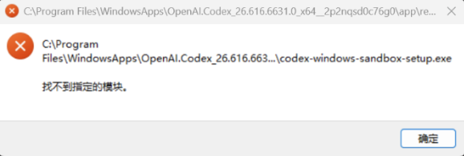

# codex-windows-safe-edit-guard

语言：中文 | [English](README.en.md)

Windows 版 Codex Desktop 有时会在文件编辑时弹出类似下面的错误：

```text
C:\Program Files\WindowsApps\OpenAI.Codex_...\app\resources\codex-windows-sandbox-setup.exe
找不到指定的模块。
```



这个项目不是修复 Codex Desktop 本体，而是在 OpenAI 修复前，让 Windows 用户通过项目级规则避开 `apply_patch` / 内置 file edit helper 这条高风险路径，改用更可观察的 PowerShell/Python UTF-8 写入流程继续工作。

它是 workaround / guardrail，不是官方修复；不修改 WindowsApps，不重打包 MSIX，不替换 OpenAI binary，不禁用 sandbox，也不承诺 100% fix。

## 这个问题是什么？

常见表现是：

- 普通 PowerShell、Python、Node 命令可以运行。
- 一到 Codex 修改文件，尤其是使用 `apply_patch` 或内置 file edit helper，就弹出 `codex-windows-sandbox-setup.exe`。
- 弹窗里可能写着“找不到指定的模块”或 `The specified module could not be found`。
- 手机端或网页端看起来一直 running，但 Windows 桌面端其实在等你处理弹窗。
- 有时 patch 看起来成功了，但弹窗仍然出现，导致后续状态不可信。

这个仓库做的事很简单：给项目加一套规则和小工具，让 Codex 不走那条容易触发弹窗的编辑路径。

## 为什么会发生？

根据公开 issue 和用户复现，问题常见于 Codex Windows Desktop 使用 `apply_patch` 或内置文件编辑 helper 时。普通 PowerShell/Python/Node 命令可能正常，但编辑路径会触发 `codex-windows-sandbox-setup.exe`。

这看起来更像 Windows Desktop / AppX / sandbox helper 启动链路的上游问题，而不是项目代码错误或电脑中毒。这里不声称已经确认根因，也不把它包装成官方诊断结论。

## 为什么本项目不从根部修？

真正修复应该由 Codex Desktop 上游完成。直接修改 WindowsApps、重打包 MSIX、改 `app.asar` 或替换 OpenAI binary，风险都比较高：

- 可能需要管理员权限或破坏 Windows 应用完整性。
- 可能影响 Codex Desktop 自动更新。
- 可能让问题更难回滚。
- 普通项目开发不应该依赖修改应用安装目录。

所以本项目选择 project-level guardrail：规则写在项目里，脚本也只在项目里工作。不需要管理员权限，容易撤销，也不污染 Codex 安装。

## 本项目如何绕开？

它让 Codex 遵守这些规则：

- 不使用 `apply_patch`。
- 不使用 Codex 内置 file edit helper。
- 修改文件前先列计划和文件清单，等用户确认。
- 创建/修改文件只用 PowerShell 或 Python，并显式使用 UTF-8。
- 写入中文等非 ASCII 内容后读回，检查有没有变成 `???`。
- 修改后运行 `git status --short` 和 `git diff --name-only`。
- 不 commit、不 push，除非用户明确要求。

## 文件结构

```text
README.md                                  中文主文档
README.en.md                               English README
README.zh-CN.md                            兼容旧链接的跳转页
SKILL.md                                   Agent Skill 说明
agents/openai.yaml                         基础 metadata
templates/AGENTS.md.template               可复制到项目的规则模板
templates/CODEX_SAFE_EDIT_RULES.md         新手解释版规则
scripts/install-agents-rule.ps1            安装 AGENTS.md 规则
scripts/diagnose-codex-windows-sandbox.ps1 只读诊断
scripts/codex-sandbox-canary.ps1           UTF-8 / Python / git canary
scripts/safe_write_utf8.py                 UTF-8 安全写文件
scripts/safe_replace_text.py               UTF-8 安全文本替换
references/known-issues.md                 已知问题和关键词
references/failure-patterns.md             常见症状
references/why-not-patch-windowsapps.md    为什么不 patch WindowsApps
examples/                                  示例项目说明
assets/                                    截图资源目录
```

## 三种使用方式

### A. 手动复制 AGENTS.md 模板

把 `templates/AGENTS.md.template` 的内容复制到目标项目的 `AGENTS.md`。如果目标项目已经有 `AGENTS.md`，把规则合并进去即可。

复制后，在 Codex 里明确告诉它：按 `AGENTS.md` 执行，不要使用 `apply_patch`。

### B. 用 PowerShell 安装到目标项目

在本仓库目录运行：

```powershell
powershell -NoProfile -ExecutionPolicy Bypass -File .\scripts\install-agents-rule.ps1 -ProjectRoot D:\path\to\your-project
```

脚本只会修改目标项目的 `AGENTS.md`。如果已有 `AGENTS.md`，会先备份成 `AGENTS.md.bak_yyyyMMdd_HHmmss`。

### C. 直接把 prompt 丢给 Codex

如果你不熟悉 PowerShell，也可以把下面的 prompt 发给 Codex，让它按 safe-edit 方式安装规则。重点是：它仍然不能用 `apply_patch`。

中文 prompt：

```text
当前 Windows Codex Desktop 可能在 apply_patch / file edit helper 时触发 codex-windows-sandbox-setup.exe 找不到指定模块。请不要使用 apply_patch。请把 codex-windows-safe-edit-guard 的 AGENTS.md 规则安装到当前项目。所有写文件都通过 PowerShell 或 Python UTF-8 完成。写前列计划和文件清单，等待我确认；写后检查 git status --short 和 git diff --name-only，并检查非 ASCII 内容没有变成 ???。不要 commit，不要 push。
```

English prompt:

```text
This Windows Codex Desktop project may trigger a codex-windows-sandbox-setup.exe "The specified module could not be found" error when using apply_patch or the built-in file edit helper. Do not use apply_patch. Install the codex-windows-safe-edit-guard AGENTS.md rules into the current project. Write files only through PowerShell or Python with explicit UTF-8. Before editing, list the plan and files and wait for my confirmation. After editing, run git status --short and git diff --name-only, and verify non-ASCII text did not become ???. Do not commit or push.
```

## 小白快速开始

1. 下载或 clone 本仓库。
2. 打开 PowerShell，进入本仓库目录。
3. 运行安装命令，把规则装到你的项目里：

```powershell
powershell -NoProfile -ExecutionPolicy Bypass -File .\scripts\install-agents-rule.ps1 -ProjectRoot D:\path\to\your-project
```

4. 在目标项目里让 Codex 继续工作，并提醒它遵守 `AGENTS.md`。
5. 如果想测试当前机器的安全写入路径，运行：

```powershell
powershell -NoProfile -ExecutionPolicy Bypass -File .\scripts\codex-sandbox-canary.ps1
```

6. 如果想收集只读诊断信息，运行：

```powershell
powershell -NoProfile -ExecutionPolicy Bypass -File .\scripts\diagnose-codex-windows-sandbox.ps1
```

## 常见问题

### 这是 OpenAI 官方项目吗？

不是。本项目不是 OpenAI 官方项目，也不代表 OpenAI 官方修复方案。

### 它会修好 Codex Desktop 吗？

不会。它只是让你的项目避开一条容易触发问题的编辑路径。真正的根部修复应该由 Codex Desktop 上游完成。

### 它会修改 WindowsApps 吗？

不会。本项目明确不修改 WindowsApps，不重打包 MSIX，不改 `app.asar`，不替换 OpenAI binary。

### 它会禁用 sandbox 吗？

不会。它不禁用 sandbox，也不绕过系统安全边界。它只是把项目内文件写入改成更普通、更可观察的 PowerShell/Python UTF-8 流程。

### 为什么要检查 `???`？

中文或其他非 ASCII 文本如果被错误编码，有时会变成 `???`。所以规则要求写后读回并检查。

### 可以直接 commit 吗？

不建议让 agent 自动 commit。先看 `git status --short` 和 `git diff`，确认没有误改后再决定。

## 局限性

- 不是官方修复。
- 不是 root fix。
- 不保证 100% 解决所有 Codex Windows 问题。
- 不能阻止 Codex Desktop 本体继续弹窗。
- 不能修复 Windows/AppX/MSIX/sandbox helper 的上游问题。
- 只能降低项目内文件编辑的风险，让工作流更可控。

## License

MIT. See [LICENSE](LICENSE).
